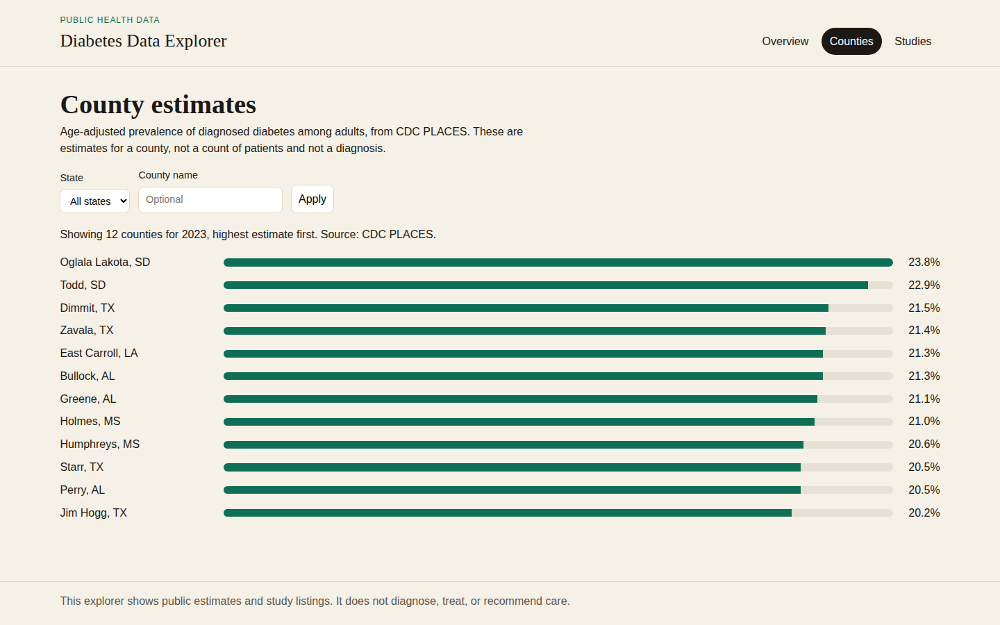
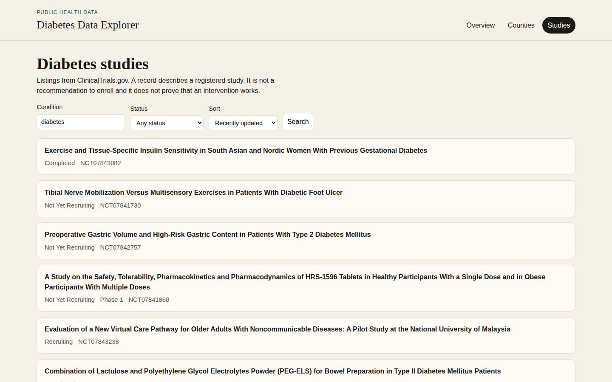
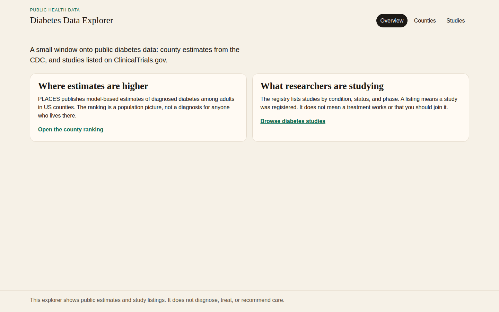

# Diabetes Data Explorer

I built this to practice the kind of frontend work that shows up in a real product: search, filters, a list, a detail page, and a chart, all fed by public data. The subject is diabetes, because the public sources are rich and the numbers need a careful caption.

You can open the demo at [https://tofariasti.github.io/diabetes-data-explorer/](https://tofariasti.github.io/diabetes-data-explorer/). The code lives in this repository.

The app is a window onto two public sources. It is not a way to diagnose anyone, choose a treatment, or decide whether to join a study.

## What you can look at

The overview is the front door. From there you can open a ranking of US counties, or a catalog of registered studies.

The county page reads CDC PLACES. It shows the age-adjusted estimate of diagnosed diabetes among adults, highest first, and you can narrow it by state or by county name. A bar is only as long as that county's estimate. Some counties are missing from the chart because the source left the number blank, and the page says so instead of inventing a zero.



The studies page reads ClinicalTrials.gov. You can search by condition, filter by status, sort the list, and step through pages. Each row opens a short record: title, status, phase, sponsor, and the summary the registry published. The full record stays on ClinicalTrials.gov.





## What the numbers are

A county figure is a model-based estimate for a population. It is not a count of patients, and it is not a diagnosis for someone who lives there. The release behind the chart is from 2023 data in the 2025 PLACES publication, so it is a picture of that year, not of this morning.

A study listing means the study was registered. It does not mean a treatment works, and it is not an invitation to enroll.

Both sources are free to call from the browser, and this demo does not need an API key. CDC PLACES covers US counties. ClinicalTrials.gov is a registry, with all the lag and uneven detail that a registry has.

## How to run it

If you have Node.js and make:

```bash
make install
make dev
```

`make help` lists the other commands: build, preview, lint, typecheck, test, and format.

## Em português

Este é um explorador de dados públicos sobre diabetes, feito para mostrar um frontend de verdade: busca, filtros, lista, detalhe e um gráfico simples. Os números vêm do CDC PLACES e do ClinicalTrials.gov. Eles não diagnosticam, não indicam tratamento e não recomendam que alguém entre em um estudo.
